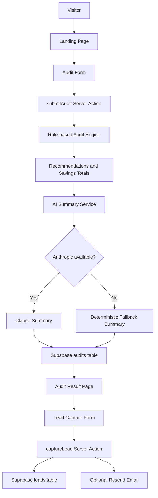
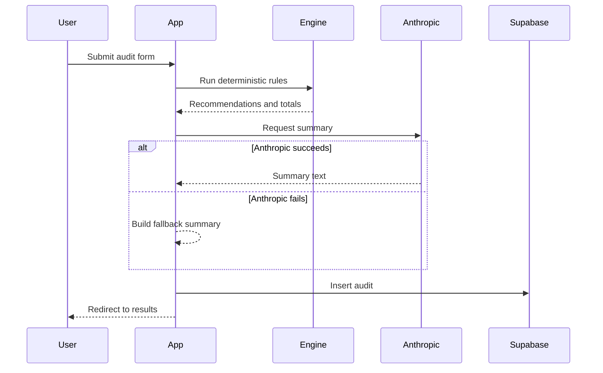

# Architecture

AI Spend Audit is intentionally small: a public form, deterministic audit engine, persisted report, AI-written summary, and lead capture.

## System Diagram

## Request and Data Flow

1. A user opens `/audit` and enters team size, primary use case, tools, plans, spend, and seats.
2. `AuditForm` calls the `submitAudit` Server Action.
3. `submitAudit` validates basic inputs and runs `runAudit()`.
4. `runAudit()` returns deterministic recommendations. It does not call an LLM.
5. `calcTotals()` computes monthly and annual savings.
6. `generateAISummary()` asks Anthropic for a concise narrative summary.
7. If Anthropic is unavailable or returns unusable output, the app uses a deterministic fallback.
8. The audit is inserted into Supabase.
9. The user is redirected to `/audit/[id]`.
10. The results page fetches the audit by ID and renders savings, findings, summary, and lead capture.
11. If the user submits lead capture, `captureLead` stores the email/company/role in Supabase and optionally sends a Resend email.

## Supabase Interaction

Tables:

- `audits`: stores form data, recommendations, savings totals, AI summary, and creation timestamp.
- `leads`: stores email, optional company/role, audit ID, and creation timestamp.

Security model:

- The browser never receives the service role key.
- Writes happen through Server Actions only.
- RLS is enabled in the schema.
- The service role key bypasses public insert restrictions on the server.

## AI Summary Flow

The AI layer is deliberately non-critical.

This keeps the product trustworthy: savings math is explainable and testable, while AI improves readability.

## Scaling to 10k Audits per Day

10k audits/day is about 7 audits/minute on average, with higher bursts during campaigns. The current architecture can handle early traffic, but these are the first scaling changes I would make:

| Area | Current MVP | 10k/day Upgrade |
| --- | --- | --- |
| Rate limiting | In-memory map | Upstash Redis or Vercel KV keyed by IP/email |
| AI summaries | Inline request | Background job queue with cached fallback first |
| Database | Supabase Postgres | Add indexes for reporting, archive old raw form data if needed |
| Observability | Console logs | Sentry plus structured event logging |
| Analytics | Not yet instrumented | PostHog/Umami events for funnel metrics |
| Email | Inline Resend call | Queue email work and retry failures |
| Abuse | Honeypot | Add turnstile/reCAPTCHA only if abuse appears |

The main bottleneck would not be the rule engine. It is fast and local. The main risks are external APIs, write bursts, and noisy lead submissions.

## Why This Shape Fits the Assignment

The assignment rewards a realistic MVP more than enterprise architecture. This architecture optimizes for:

- Fast deployment
- Clear product value
- Testable core logic
- Low operational complexity
- Easy future migration to queues, analytics, and stronger auth
